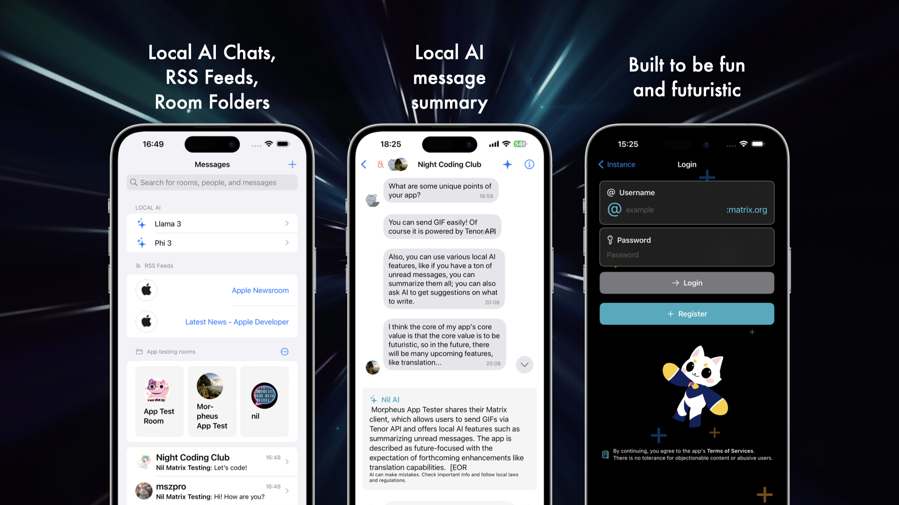
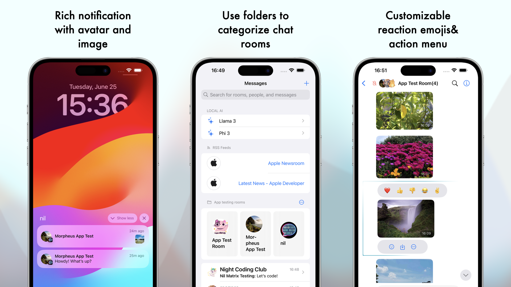
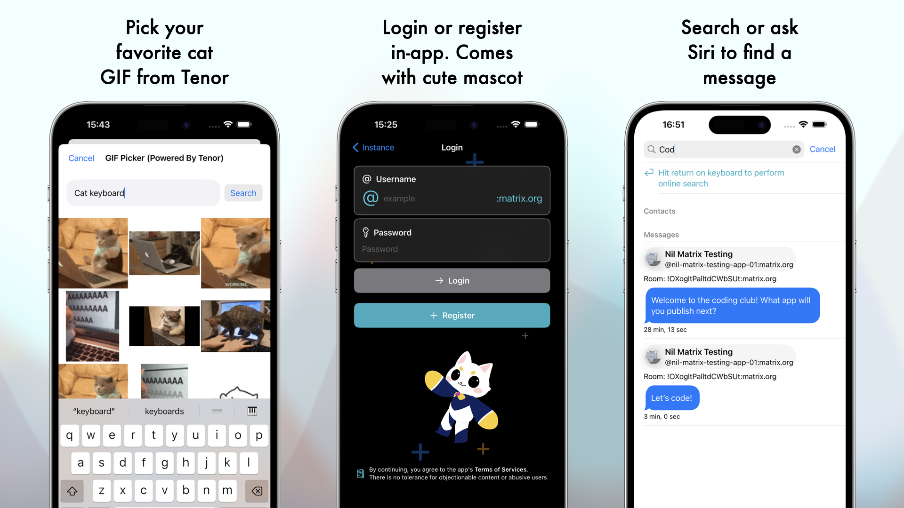
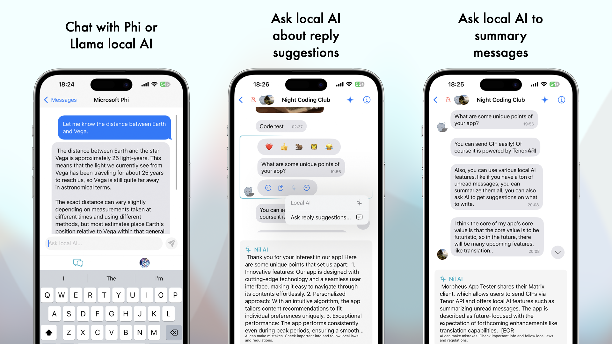

# Nil - A futuristic iOS Matrix chat client

Nil is a futuristic Matrix client offering not only features like encryption, rich notifications, share sheet, but also: - Tenor GIF picker - System sticker & Memoji picker - chat room folders - RSS reader - local AI chats, AI message summary, and more!

Currently, Nil has not open sourced yet! However, I will once I get the code more tidy and get some documentations completed.

Please feel free to use this repository to submit issue reports and feedbacks.

